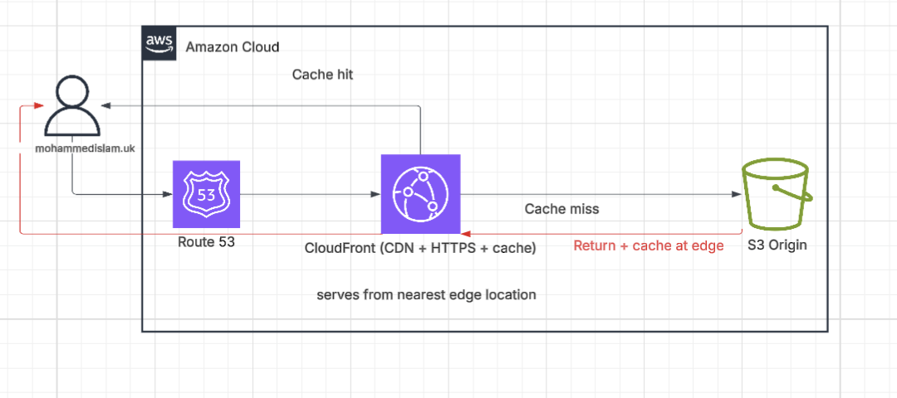
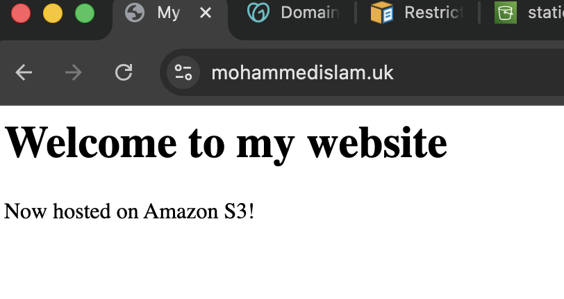
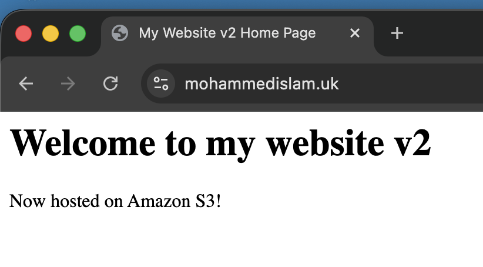

# AWS Static Website with CloudFront CDN

## 📌 Overview
This project demonstrates how to deploy a static website using AWS services:

- Amazon S3 (static hosting)
- Amazon CloudFront (CDN + HTTPS)
- Amazon Route 53 (DNS)

## Architecture

## Request Flow
1. User enters domain (mohammedislam.uk)
2. Route 53 resolves DNS and routes to CloudFront
3. CloudFront checks cache:
   - If cache hit then return content
   - If cache miss then fetch from S3 origin, cache and return

## Challenges I Faced

### CloudFront Caching
After updating the content in S3 (index.html), the website still showed the old version.

Solution:
- Created cache invalidation (`/*`) to refresh content

### S3 Endpoint Issue
Initially used the wrong endpoint (REST API), which returned XML.

Solution:
- Switched to S3 static website endpoint

### DNS & Registrar Issue
Cloudflare did not allow easy nameserver changes.

Solution:
- Transferred domain to GoDaddy to use Route 53

## Caching Demonstration

### Before Invalidation

### After Invalidation

## Cost
Built using AWS Free Tier. Total cost was under a dollar.

## Lessons
- CDN caching and invalidation
- DNS routing with Route 53
- Difference between S3 endpoints
- Real world debugging of cloud systems